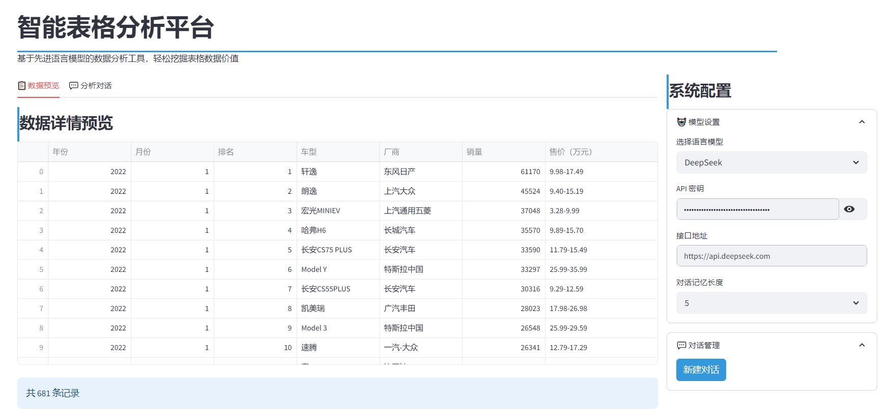
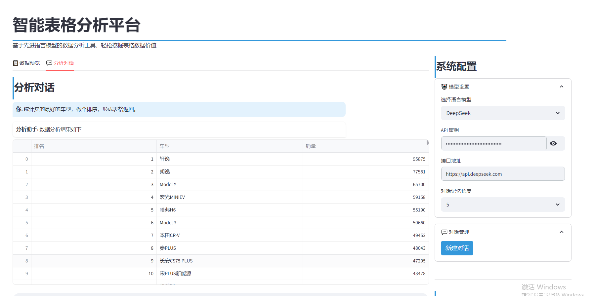
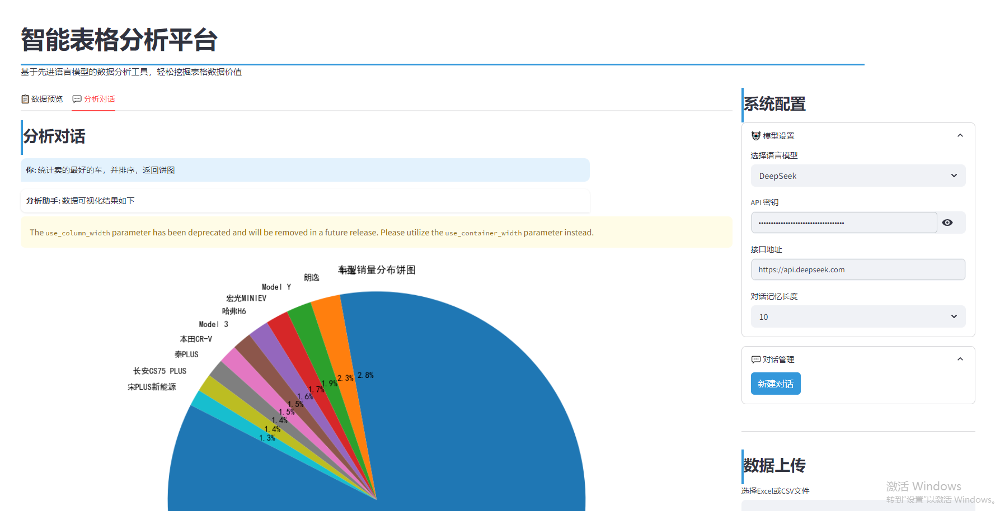

# ChatExcel

## 项目简介

ChatExcel 是一款专注于智能表格数据分析的工具，旨在通过便捷、高效的方式帮助用户挖掘 Excel 数据中的价值。该工具基于 **deepseek 大模型** 构建核心分析能力，能够深度理解 Excel 数据的结构与逻辑，支持对各类表格数据进行多维度分析与挖掘。

与传统 Excel 分析工具相比，ChatExcel 无需用户掌握复杂的函数或代码知识，仅需通过简单操作即可触发智能分析流程。分析结果支持以 **结构化表格** 或 **可视化图表**（如折线图、柱状图、饼图等）两种形式呈现，既满足数据精准查看的需求，也便于直观洞察数据趋势与关联关系，适用于日常办公数据汇总、业务报表分析、学生作业数据处理等多种场景。

## 功能案例展示

以下为 ChatExcel 实际使用过程中的案例截图，直观呈现工具的操作界面与分析结果效果：

### 案例 1：数据导入与基础分析界面



### 案例 2：表格形式分析结果



### 案例 3：可视化图表分析结果



## 环境要求（Requirements）

1. **Python 版本**：需安装 Python 3.10 及以上版本（建议使用 3.10/3.11 版本，兼容性更优）。

2. **依赖包安装**：通过以下命令安装项目所需的全部依赖包，确保工具正常运行：

```
pip install -r requirements.txt
```

*提示：若安装过程中出现依赖冲突，可尝试创建虚拟环境（如使用 venv 或 conda）后重新安装，避免影响本地其他项目环境。*

## 运行步骤（Run）

按照以下步骤操作，即可快速启动 ChatExcel 应用程序：

1. 打开终端（Windows 系统可使用命令提示符、PowerShell；Mac/Linux 系统可使用终端）。

2. 进入项目根目录（通过 `cd 项目路径` 命令切换，例如 `cd ~/ChatExcel`）。

3. 在终端中执行以下命令：

```
streamlit run main\_app.py
```

4. 命令执行成功后，终端会输出应用程序的访问链接（通常包含本地链接 `http://localhost:8501` 和局域网链接）。

5. 系统会自动在默认浏览器中打开该链接，若未自动打开，可手动复制链接粘贴到浏览器地址栏，即可进入 ChatExcel 操作界面。
